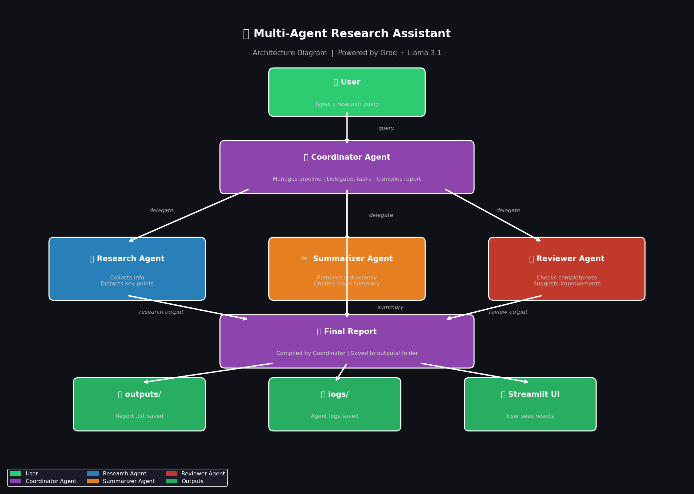

# 🤖 Multi-Agent Research Assistant

A multi-agent AI system where 4 specialized agents collaborate 
to answer any user query and generate a detailed research report.

Built with Python, Groq API (Llama 3.1), and Streamlit.

**Author: Divya Maria Manuel**

---

## 📸 Demo



---

## 🗺️ How It Works
👤 User types a query
↓
📋 Coordinator Agent  ← receives query, manages everything
↓
🔍 Research Agent     ← collects detailed information
↓
📋 Coordinator Agent  ← receives research, delegates next
↓
✂️  Summarizer Agent  ← removes redundancy, creates summary
↓
📋 Coordinator Agent  ← receives summary, delegates next
↓
✅ Reviewer Agent     ← checks completeness, improves it
↓
📋 Coordinator Agent  ← compiles everything
↓
📄 Final Report       ← saved to outputs/ folder

---

## 🤖 Agent Roles

### 1. 📋 Coordinator Agent
- Receives the user query
- Delegates tasks to each agent in order
- Collects outputs from all agents
- Compiles and saves the final report
- Manages the entire pipeline

### 2. 🔍 Research Agent
- Accepts the user query
- Searches and collects relevant information
- Extracts key concepts and important facts
- Returns detailed structured research

### 3. ✂️ Summarizer Agent
- Receives research from Coordinator
- Removes redundant and repeated content
- Creates a clean concise summary
- Returns structured bullet points

### 4. ✅ Reviewer Agent
- Receives summary from Coordinator
- Checks for completeness
- Identifies missing information
- Suggests and applies improvements
- Returns final improved version

---

## 📁 Project Structure
multi_agent_research/
│
├── 📁 agents/                   ← agent folder
├── 📁 outputs/                  ← saved reports (.txt files)
├── 📁 logs/                     ← activity logs for all agents
│   ├── coordinator_agent_20260603.log
│   ├── research_agent_20260603.log
│   ├── reviewer_agent_20260603.log
│   └── summarizer_agent_20260603.log
│
├── 📄 1_research_agent.py       ← Research Agent
├── 📄 2_summarizer_agent.py     ← Summarizer Agent
├── 📄 3_reviewer_agent.py       ← Reviewer Agent
├── 📄 4_coordinator_agent.py    ← Coordinator Agent
├── 📄 5_run.py                  ← Terminal version
├── 📄 app.py                    ← Streamlit Web UI
├── 📄 check_setup.py            ← Setup verification
├── 📄 architecture_diagram.py   ← Generates diagram
├── 📄 architecture_diagram.png  ← Architecture diagram
├── 📄 README.md                 ← This file
└── 📄 .env                      ← API keys (never share!)

---

## ⚙️ Setup Instructions

### STEP 1: Create project folder
```bash
mkdir multi_agent_research
cd multi_agent_research
```

### STEP 2: Install required libraries
```bash
pip install groq python-dotenv streamlit matplotlib
```

### STEP 3: Get your FREE Groq API key
1. Go to https://console.groq.com
2. Sign up for free (no credit card needed!)
3. Click API Keys → Create API Key
4. Copy the key (starts with gsk_...)

### STEP 4: Create .env file
GROQ_API_KEY=your_key_here

### STEP 5: Verify setup
```bash
python check_setup.py
```

### STEP 6: Run the app
```bash
streamlit run app.py
```

---

## 🚀 How to Use

### Option 1 — Web UI (Recommended)
```bash
streamlit run app.py
```
1. Browser opens automatically
2. Type any research question
3. Click **Start Research**
4. Watch all 4 agents work live
5. Download the final report

### Option 2 — Terminal
```bash
python 5_run.py
```
1. Type your question
2. Press Enter
3. See agents working in terminal
4. Report saved to outputs/ folder

---

## 🔄 Agent Communication Flow

User types query
↓
Coordinator Agent receives query
↓
Coordinator → delegates to → Research Agent
Research Agent → returns research → Coordinator
↓
Coordinator → delegates to → Summarizer Agent
Summarizer Agent → returns summary → Coordinator
↓
Coordinator → delegates to → Reviewer Agent
Reviewer Agent → returns improved version → Coordinator
↓
Coordinator compiles everything
↓
Final report saved to outputs/ folder


---

## 🛠️ Technical Stack

| Component | Technology |
|-----------|-----------|
| Language | Python 3.x |
| LLM | Llama 3.1 (via Groq) |
| Agent Framework | Custom built |
| UI | Streamlit |
| API | Groq API (Free tier) |
| Logging | Python logging module |
| Diagram | Matplotlib |

---

## 📊 Sample Output

**Input:** `Explain Kubernetes architecture`

**Research Agent Output:**
- Detailed notes on Kubernetes components
- Key concepts with headings and bullet points
- Important facts about scalability and security

**Summarizer Agent Output:**
- Clean 3-section summary
- 5-7 key bullet points
- 3-5 important facts

**Reviewer Agent Output:**
- Review notes on what was missing
- Improved and complete summary
- Final verdict on quality

**Final Report:** Saved to `outputs/Explain_Kubernetes_architectur.txt`

---

## 📝 Logs

Every agent run is logged automatically:
logs/
├── coordinator_agent_20260603.log
├── research_agent_20260603.log
├── reviewer_agent_20260603.log
└── summarizer_agent_20260603.log

Log format:
2026-06-03 09:42:10 - INFO - Coordinator started | Query: Explain Kubernetes
2026-06-03 09:42:10 - INFO - STEP 1 — Calling Research Agent
2026-06-03 09:42:11 - INFO - STEP 1 complete | Size: 2337 chars
2026-06-03 09:42:11 - INFO - STEP 2 — Calling Summarizer Agent
2026-06-03 09:42:12 - INFO - STEP 2 complete | Size: 1389 chars
2026-06-03 09:42:12 - INFO - STEP 3 — Calling Reviewer Agent
2026-06-03 09:42:13 - INFO - STEP 3 complete | Size: 1465 chars
2026-06-03 09:42:13 - INFO - Report saved to: outputs/Explain_Kubernetes.txt
2026-06-03 09:42:13 - INFO - Coordinator finished successfully!

---

## ✅ Evaluation Criteria Met

| Criteria | How we met it |
|----------|--------------|
| Understanding of AI Agents | 4 agents with clear distinct roles |
| Agent orchestration design | Coordinator manages full pipeline |
| Code quality | Clean code with comments in every file |
| Error handling | try/except blocks in every agent |
| Documentation quality | Full README with diagrams and examples |
| Ability to explain workflow | Streamlit UI shows live agent communication |

---

## ⚠️ Important Notes

- Never share your `.env` file or API key
- Reports are saved automatically to `outputs/` folder
- Works with ANY topic or question
- Free to use with Groq's free tier
- Groq free tier: ~4,800 full research queries per day!

---

## 🔮 Future Improvements

- Add web scraping for real-time information
- Add more specialized agents (Fact Checker, Citation Agent)
- Add support for multiple languages
- Add export to PDF feature
- Add history of past research queries

---

## 👤 Author

**Divya Maria Manuel**

Built as part of a Multi-Agent AI Systems project.